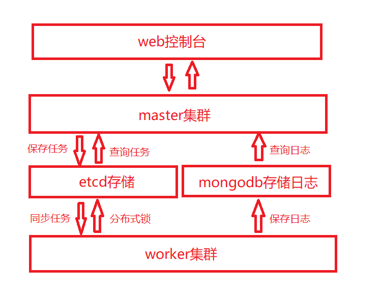

#### 项目简介

在传统的crontab中，至少有以下三个痛点：

- 机器故障，任务停止调度
- 任务数量过多，导致服务器硬件资源耗尽，要人工迁移到其他服务器
- 需要ssh到服务器配置crontab，任务的执行状态、日志也很不方便查看

所以一个理想的crontab至少要包含以下两点：

- 高可用：任务不会因为单点故障停止调度
- 扩展性：要有处理大量任务的能力。当服务器硬件资源不够的时候，单纯的加服务器就可以了

本项目正是为了解决上述场景而诞生的

#### 项目架构

- 利用etcd同步全量任务列表到所有worker节点
- 每个worker独立调度全量任务
- 各个worker利用分布式锁抢占，解决并发调度相同任务的问题

#### 主要接口

master功能
1.任务管理接口：新建、修改、查看、删除任务 --> etcd（/cron/jobs）
etcd结构：/cron/jobs/任务名
name 任务名
command shell命令
cronExpr cron表达式
保存到etcd的任务，会被实时同步到所有worker

2.任务日志接口：查看任务执行历史日志 -->mongodb
mongodb结构
jobName 任务名
command shell命令
err 执行报错
output 执行输出
startTime 开始时间
endTime 结束时间
master会请求mongodb，按任务名查看最近的执行日志

3.任务控制接口：强制结束任务接口 -->etcd（/cron/killer）
etcd结构：/cron/killer/任务名
worker监听/cron/killer/目录下put修改操作
msater将要结束的任务名put在/cron/killer/目录下，触发worker立即结束shell任务

4.web管理界面

worker功能

任务同步：监听etcd中/cron/jobs目录变化
任务调度：基于cron表达式计算，触发过期任务
任务执行：协程池并发执行多任务，基于etcd分布式锁抢占
日志保存：捕获任务执行输出，保存到mongodb

监听协程

利用watch API，监听/cron/jobs/和/cron/killer/目录的变化
将变化事件通过channel推送给调度协程，更新内存中的任务信息

调度协程

监听任务变更event，更新内存中维护的任务列表
检查任务cron表达式，扫描到期任务，交给执行协程运行
监听任务控制event，强制中断正在执行中的子进程
监听任务result，更新内存中任务状态，投递执行日志

执行协程

在etcd中抢占分布式乐观锁：/cron/lock/任务名
抢占成功则通过command类执行shell任务
捕获command输出并等待子进程结束，将执行结果投递给调度协程

日志协程

监听调度发来的执行日志，放入一个batch中
对新batch启动定时器，超时未满自动提交
若batch被放满，那么立即提交，并取消自定提交定时器